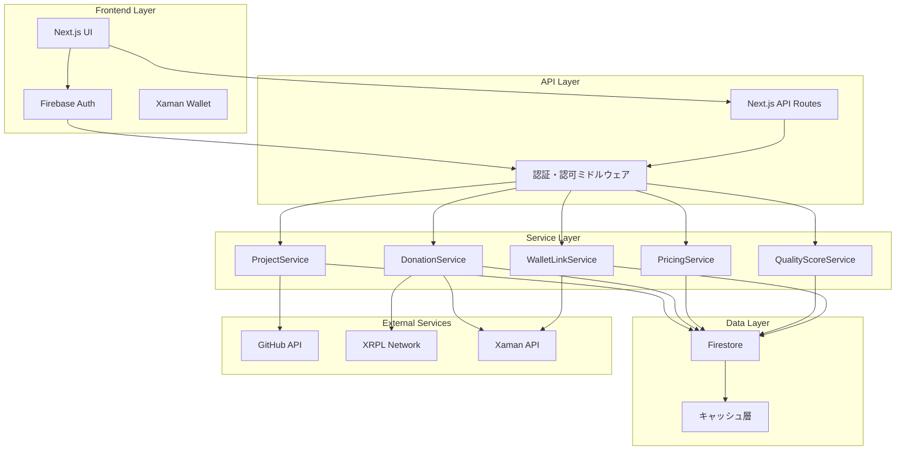
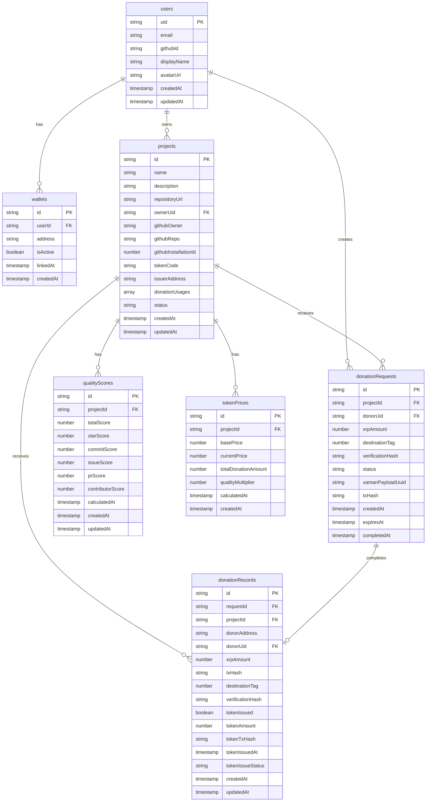
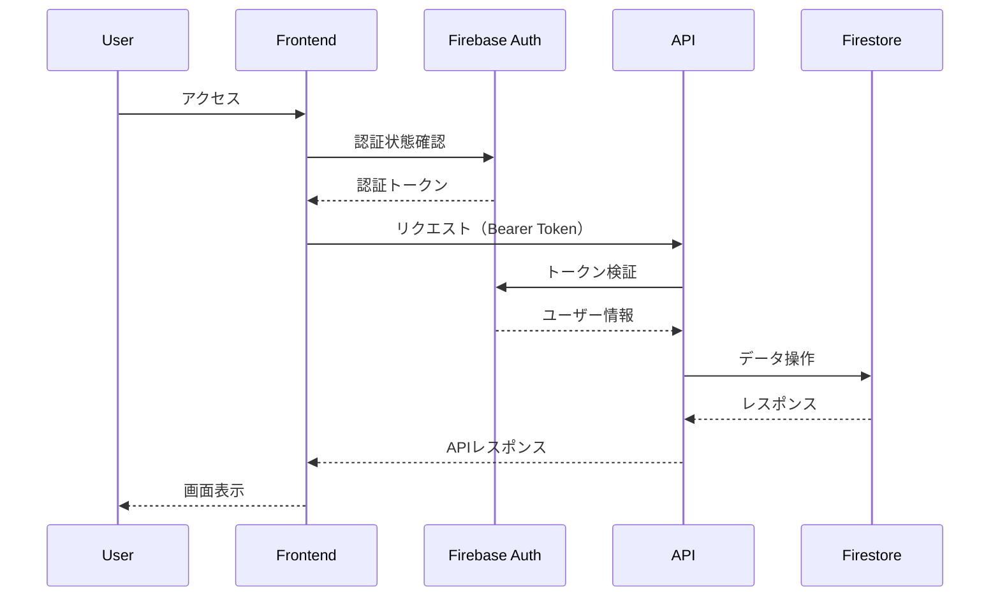
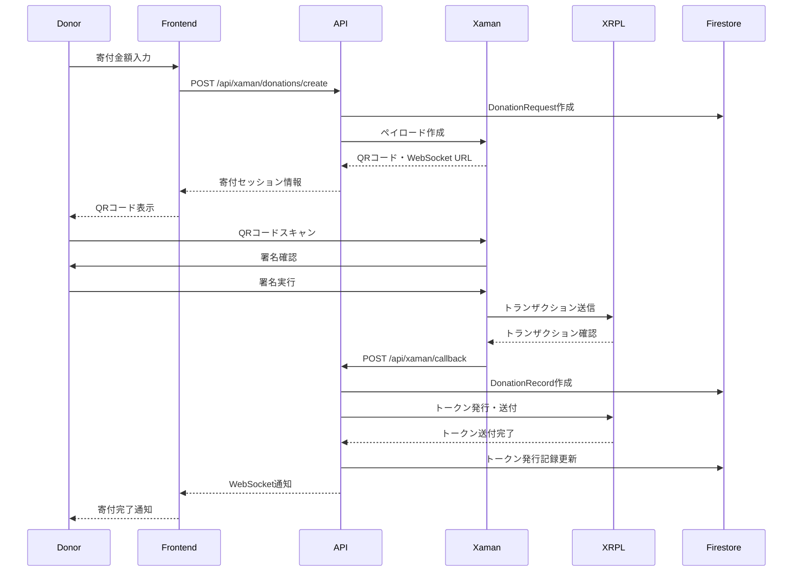
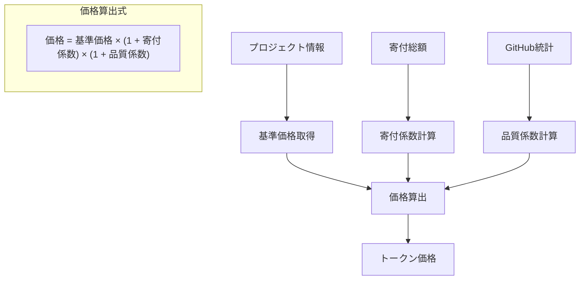
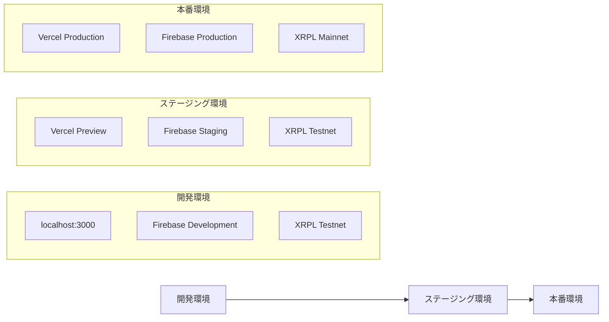

# OSS Token Platform - アーキテクチャドキュメント

## 概要

OSS Token Platformは、GitHubとXRPLを連携したオープンソースプロジェクト向けトークン化プラットフォームです。OSSプロジェクトごとにトークンを発行し、寄付・貢献者報酬・ユーティリティ提供を通じてOSSの持続的な発展を支援します。

## システム全体アーキテクチャ



## 技術スタック

### フロントエンド

- **Next.js**: React フレームワーク（App Router使用）
- **TypeScript**: 型安全性の確保
- **Tailwind CSS**: スタイリング
- **React Hot Toast**: 通知システム

### バックエンド

- **Next.js API Routes**: サーバーサイドAPI
- **Firebase Admin SDK**: サーバーサイド認証・データベース操作

### データベース・認証

- **Firebase Firestore**: NoSQLデータベース
- **Firebase Auth**: 認証システム（GitHub OAuth）

### ブロックチェーン

- **XRPL (XRP Ledger)**: トークン発行・送金
- **Xaman SDK**: ウォレット連携・署名

### 開発・テスト

- **Bun**: パッケージマネージャー・テストランナー
- **ESLint + Prettier**: コード品質・フォーマット
- **Playwright**: E2Eテスト
- **Husky + Commitlint**: Git フック・コミット規約

### CI/CD・インフラ

- **Vercel**: ホスティング・デプロイ

## データベース設計

### Firestoreコレクション構造



## API設計

### 認証・認可フロー



### 主要APIエンドポイント

#### プロジェクト管理

- `GET /api/projects` - 公開プロジェクト一覧
- `POST /api/projects` - プロジェクト作成
- `GET /api/projects/[id]` - プロジェクト詳細
- `PUT /api/projects/[id]` - プロジェクト更新
- `GET /api/management/projects` - メンテナー向けプロジェクト一覧

#### 寄付システム

- `POST /api/xaman/donations/create` - 寄付セッション作成
- `GET /api/xaman/donations/[requestId]` - 寄付ステータス確認
- `POST /api/xaman/callback` - Xamanコールバック処理

#### ウォレット連携

- `POST /api/xaman/wallets` - ウォレット連携開始
- `GET /api/xaman/wallets/link-status` - 連携ステータス確認

#### 統計・分析

- `GET /api/donor/stats` - 寄付者統計
- `GET /api/maintainer/stats` - メンテナー統計

## 寄付フロー



## トークン価格算出システム

### 価格算出アルゴリズム



### 品質スコア計算

```typescript
// 品質スコア算出ロジック
const qualityScore = {
  starScore: Math.min(stars / 1000, 1.0) * 20,
  commitScore: Math.min(commits / 100, 1.0) * 15,
  issueScore: Math.min(issues / 50, 1.0) * 10,
  prScore: Math.min(pullRequests / 20, 1.0) * 10,
  contributorScore: Math.min(contributors / 10, 1.0) * 15,
}
```

## セキュリティ設計

### 認証・認可

- Firebase Auth による GitHub OAuth 認証
- JWT トークンベースの API 認証
- Firestore セキュリティルールによるデータアクセス制御

### XRPL セキュリティ

- マルチシグネチャウォレット対応
- 秘密鍵の暗号化保存
- トランザクション署名の検証

### API セキュリティ

- CORS 設定
- レート制限
- 入力値検証（Zod スキーマ）
- SQL インジェクション対策（NoSQL使用）

## パフォーマンス最適化

### フロントエンド

- Next.js App Router による自動コード分割

### データベース

- Firestore インデックス最適化
- クエリ最適化

## デプロイメント

### 環境構成



## 拡張性・スケーラビリティ

### 水平スケーリング

- Vercel の自動スケーリング
- Firebase の自動スケーリング
- XRPL の分散処理

### 垂直スケーリング

- Edge Functions の活用
- データベースクエリ最適化
- キャッシュ戦略の改善

## 開発ガイドライン

### コーディング規約

- TypeScript strict モード
- ESLint + Prettier による自動フォーマット
- Conventional Commits
- 関数型プログラミングの推奨

### テスト戦略

- 単体テスト（Bun Test）
- 統合テスト
- E2E テスト（Playwright）
- パフォーマンステスト

### ドキュメント管理

- ADR（Architecture Decision Record）
- API ドキュメント
- 運用手順書
- トラブルシューティングガイド

## トラブルシューティング

### よくある問題と解決方法

#### Firebase 接続エラー

```bash
# 環境変数の確認
echo $FIREBASE_PROJECT_ID

# Firebase プロジェクト接続確認
firebase projects:list
```

#### XRPL 接続エラー

```bash
# ネットワーク状態確認
curl -X POST https://s.altnet.rippletest.net:51234 \
  -H "Content-Type: application/json" \
  -d '{"method":"server_info","params":[]}'
```

#### Xaman 連携エラー

```bash
# ngrok の起動確認（開発環境）
ngrok http 3000

# コールバック URL の確認
echo $XUMM_CALLBACK_URL
```

## 参考資料

- [Next.js Documentation](https://nextjs.org/docs)
- [Firebase Documentation](https://firebase.google.com/docs)
- [XRPL Documentation](https://xrpl.org/docs.html)
- [Xaman Developer Documentation](https://docs.xaman.app/)
- [Vercel Documentation](https://vercel.com/docs)

---

このドキュメントは継続的に更新され、システムの成長とともに進化していきます。
