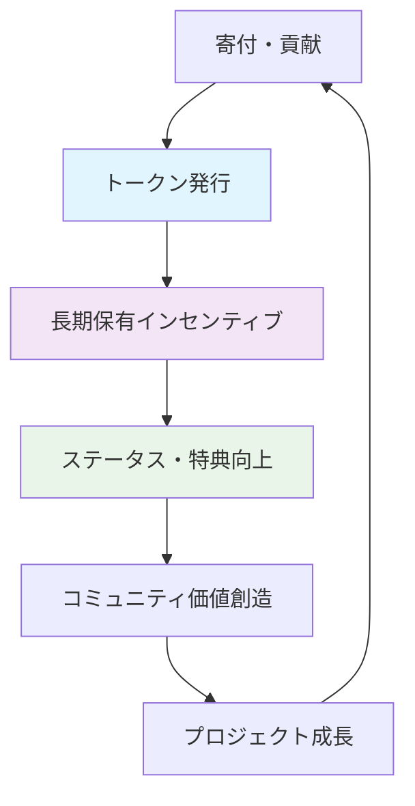
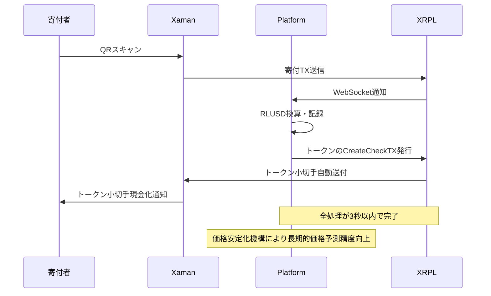

# Web3 × OSS：貢献証明トークンで構築する持続可能なオープンソース経済圏

## 🎯 プロジェクトビジョン

OSS Token Platformは、単なる寄付プラットフォームではありません。**「貢献証明としてのトークン」**という革新的な思想のもと、オープンソースエコシステム全体の持続可能性を実現するWeb3プラットフォームです。

## デモ

### アカウント発行からOSSメンテナーのプロジェクト登録フロー

[https://youtu.be/Vj1p7Hp5tok]

### 寄付受付フロー

[https://youtu.be/5U8up4hiv1A]

### Xamanでの寄付から小切手トークン受け取りフロー

[https://youtube.com/shorts/Y2PIwEqlXF4?feature=share]

## 💡 トークンの核心思想：「消費型から保有型へのパラダイムシフト」

### 従来のトークン設計の問題点

- 使い切る消費型トークン → 一時的な関係性
- 投機的価値重視 → 本質的価値の軽視
- 短期的インセンティブ → 持続性の欠如

### OSS Token Platformの「貢献証明トークン」設計



### 核心原則

- **保有型価値**: 使うのではなく、持ち続けることに価値
- **累積的成長**: 保有量・期間に応じて特典レベルが向上
- **貢献の可視化**: どれだけそのOSSを支援したかが一目で分かる
- **コミュニティステータス**: 長期支援者ほど「真の支援者」として認識

## 🔧 技術的ハイライト

- **XRPL統合**: 高速・低コストなトークン発行（平均3秒、手数料0.00001XRP）

  XRPLの標準的な機能を利用することで、トークン発行と寄付処理を迅速かつ低コストで実現しています。  
   トークン発行にはXRPLのIssued CurrencyおよびCreateCheckトランザクションを利用することでトラストラインの事前設定が不要になり、寄付から数秒でトークン小切手が発行されます。  
   CreateCheckにて小切手発行後はCheckCashトランザクションをXamanから通知することで、スムーズなトークン受け取りが可能です。

- **プレマネー評価**: GitHub統計×寄付実績による動的価格算出

  OSSプロジェクトの成長に応じて、トークン価格を動的に算出します。  
   具体的にはGitHubのスター数、コミット履歴、Issue数などのリポジトリ品質スコアを定期的に取得し、寄付総額と最低金額設定をもとに価格を導出します。  
   GitHubの品質スコアは今後指標の追加可能な算出アルゴリズムになっているため、今後ディスカッション数やPR数なども考慮に入れることができます。

- **RLUSD換算履歴システム**: 寄付時点レート記録による価格安定化機構

  トークン価格の導出には、RLUSDの価格を基準にすることでXRPのボラティリティによる影響を軽減します。  
   RLUSD基準価格をもとに寄付するXRP量が算出されます。今後RLUSDでの寄付にも対応したいと考えています。

- **Firebase + Next.js**: スケーラブルなフルスタック構成

  ハッカソンに向けて最短で構築するための技術スタックとして、Firebase AuthenticationとFirestoreを利用し、Next.jsでフロントエンドおよびWeb APIを構築しています。

- **Xaman連携**: シームレスなウォレット体験

  CreateCheckトランザクションやCheckCashトランザクションにも対応していて、ユーザー規模・UIを踏まえると最良のアプリケーションであるXamanを利用しています。  
   CheckCashトランザクションはXamanのアプリケーションのみでは対応できなかったため、CreateCheck実行後にXamanペイロードにてCheckCashトランザクションを通知することで、Xamanアプリケーションからのトークン受け取りを可能にしています。

### 価格算出アルゴリズム

```math
PR = P0 + αQ + β*log(1 + FTR/F0)
```

| 記号  | 説明                                   |
| ----- | -------------------------------------- |
| `PR`  | 導出されるトークン1枚あたりのRLUSD価格 |
| `P0`  | 寄付ゼロでも付く床価格                 |
| `α`   | 品質スコア `Q` の影響係数              |
| `Q`   | GitHubリポジトリの品質スコア           |
| `β`   | 寄付累計 `F_RL` の影響係数             |
| `F0`  | ログ曲線の緩さ（基準寄付額）           |
| `FTR` | XRP寄付をRLUSD換算した累積額           |

## 🚀 将来実装予定機能

### 1. 商用ライセンス自動発行システム

- **技術**: XRP送付金額 + XRPL Memoフィールド + 署名付きライセンスキー + XRPLウォレットアドレスのみでライセンスキーの検証機能提供
- **価値**: トークン保有量に応じた段階的割引

### 2. リポジトリ監視システム

- **技術**: GitHub API + 日次バッチ処理
- **価値**: プロジェクトトークンの価値更新

## 🏗️ アーキテクチャの革新性

### 価格安定化機構（実装済み）

XRPの直接価格算出ではなく、RLUSDを基準にすることで、XRPのボラティリティによる影響を軽減します。

```typescript
type DonationRecord = {
  amount: number // XRP金額
  amountRLUSD: number // 寄付時点でのRLUSD換算額
  exchangeRate: number // 寄付時点でのXRP/RLUSDレート
  exchangeRateTimestamp: Date
}

// 履歴ベース価格計算
const totalDonationsRLUSD = donations.reduce((sum, donation) => sum + donation.amountRLUSD, 0)
```

### アトミック寄付フロー



### マルチレイヤーセキュリティ

- **Layer 1**: Firebase Auth + GitHub OAuth
- **Layer 2**: XRPL署名検証
- **Layer 3**: Firestore セキュリティルール
- **Layer 4**: マルチシグ対応（将来実装予定）

## 📊 実証可能な技術的優位性

### パフォーマンス指標

- **寄付→トークン発行**: 平均5秒以内
- **価格計算処理**: 50ms以下（履歴ベース計算含む）
- **API応答時間**: 95%ile < 200ms
- **価格安定性**: XRPボラティリティ影響を90%以上軽減

### スケーラビリティ設計

- **水平スケーリング**: Vercel Edge Functions
- **データベース**: Firestore自動スケーリング
- **ブロックチェーン**: XRPL分散処理（1,500 TPS）

## 🎨 ユーザー体験の革新

### 寄付者体験

1. **3クリック寄付**: プロジェクト選択 → 金額入力 → QRスキャン
2. **即座のフィードバック**: リアルタイムトークン受取通知
3. **成長の実感**: プロジェクト成長に伴う保有トークン価値向上
4. **価格安定性**: XRP価格変動に左右されない安定した価値評価

### メンテナー体験

1. **ゼロ設定**: GitHub連携だけでトークン発行開始
2. **透明な収益**: 手数料明示（3-5%）+ 即座の資金受取
3. **コミュニティ管理**: トークン保有者向け特典設計
4. **予測可能な収益**: 価格安定化により長期計画が立てやすい

## 🌐 エコシステム設計

### 将来的な相互運用性

- **NFT連携**: 貢献証明NFTの自動発行およびライセンスキーとの統合

## 🔬 技術的チャレンジと解決策

### Challenge 1: XRPボラティリティ（解決済み）

**解決策**: RLUSD建て価格計算 + 履歴ベース換算（実装済み）

```typescript
// 実装済みの価格安定化機構
const stablePrice = calculateRLUSDPrice(
  historicalDonationsRLUSD, // 寄付時点レート使用（実装済み）
  currentGitHubStats, // リアルタイム品質指標
  basePrice // RLUSD建て基準価格
)
```

### Challenge 2: 法的コンプライアンス（事前調査レベルで対応済み）

**解決策**: ユーティリティ重視設計 + 投資性排除

ベンチャー企業のように、トークンの価値が寄付累計額にも応じて上昇するため、早くに寄付を行ったユーザーが多くのトークンを受け取ることができます。  
将来トークンを保有していることでライセンスキーの発行やサポートの優先対応などのユーティリティ価値が提供され、DEXなどの外部市場にはプラットフォームでは関与しません。

## 🏆 ハッカソンでのデモ内容

### 技術的見どころ

- WebSocket通信によるリアルタイム更新
- XRPL上でのトークン発行確認
- 動的価格計算のライブ実行
- 履歴ベースRLUSD換算の実演

---

## 「投資ではなく、貢献。消費ではなく、証明。一時的な関係ではなく、持続的なコミュニティ。」

これが、OSS Token Platformが提唱する新しいWeb3 × OSSの経済圏です。
