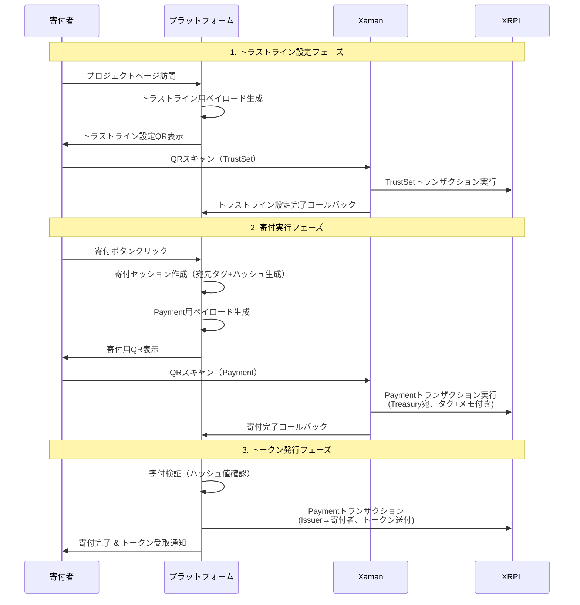

# ADR-20250603-01: 寄付フローとトークン発行システムについて

## ステータス

Approved

## 日付

2025-06-03

## 背景

OSS Token Platformにおいて、寄付者がプロジェクトに寄付を行い、その対価としてプロジェクト固有のトークンを受け取るシステムを実装する必要がある。寄付の識別、トークンの発行、配布を安全かつ効率的に行うためのアーキテクチャを決定する。

## 決定事項

### ウォレット構成

1. **Issuer Wallet**: トークン発行専用ウォレット
2. **Treasury Wallet**: 寄付受取専用ウォレット（宛先タグ対応）

### 寄付識別システム

- **宛先タグ**: プロジェクトIDまたは寄付セッションIDによる識別
- **メモフィールド**: プラットフォーム発行のハッシュ値による寄付認証
- **Xamanペイロード**: 寄付完了の検知とコールバック処理

### システムフロー



## 実装コンポーネント

### ライブラリ構成

- `src/lib/xrpl/config.ts`: XRPL設定管理
- `src/lib/xrpl/client.ts`: XRPL接続クライアント
- `src/lib/xrpl/donation-service.ts`: 寄付・トラストライン統合サービス
- `src/lib/xrpl/token-issue-service.ts`: トークン発行・送付サービス

### APIエンドポイント

- `src/app/api/donations/create/route.ts`: 寄付セッション作成
- `src/app/api/donations/callback/route.ts`: Xamanコールバック処理
- `src/app/api/xaman/trustline/route.ts`: トラストライン設定

### データ構造

```typescript
type DonationSession = {
  id: string
  projectId: string
  donorAddress: string
  amount: number
  destinationTag: number
  verificationHash: string
  status: 'pending' | 'completed' | 'failed'
  xamanPayloadId?: string
  txHash?: string
  createdAt: Date
}
```

## セキュリティ考慮事項

1. **寄付認証**: ハッシュ値による寄付の真正性確認
2. **プロジェクト識別**: 宛先タグによる確実なプロジェクト特定
3. **セッション管理**: Xamanペイロード有効期限による不正利用防止
4. **重複防止**: 同一寄付の重複処理防止機能

## 理由

1. **Xamanペイロード活用**: ユーザビリティとセキュリティの両立
2. **宛先タグ利用**: 単一ウォレットでの効率的な寄付管理
3. **メモフィールド認証**: 外部からの不正寄付の排除
4. **分離されたウォレット**: セキュリティリスクの最小化

## 影響

- 寄付者は2段階のXamanトランザクション（トラストライン設定 + 寄付）を実行
- プラットフォームは寄付の自動検知と即座のトークン配布が可能
- 管理者は寄付とトークン発行の完全な追跡が可能

## 関連文書

- [MVP開発タスク一覧](../MVP.md)
- [プラットフォーム仕様書](../Specification.md)
