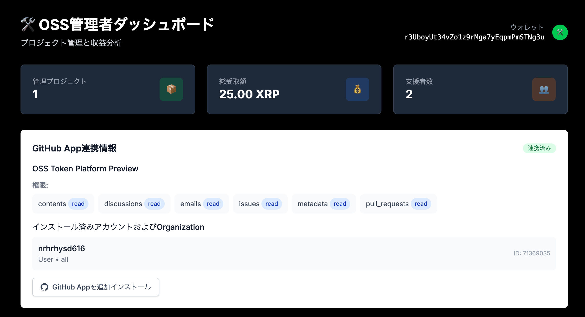
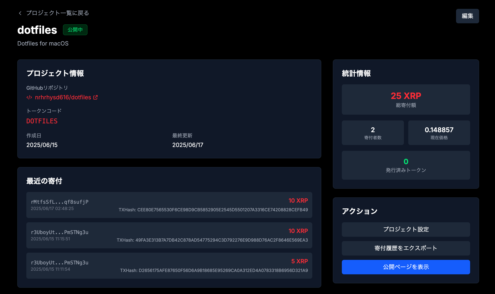
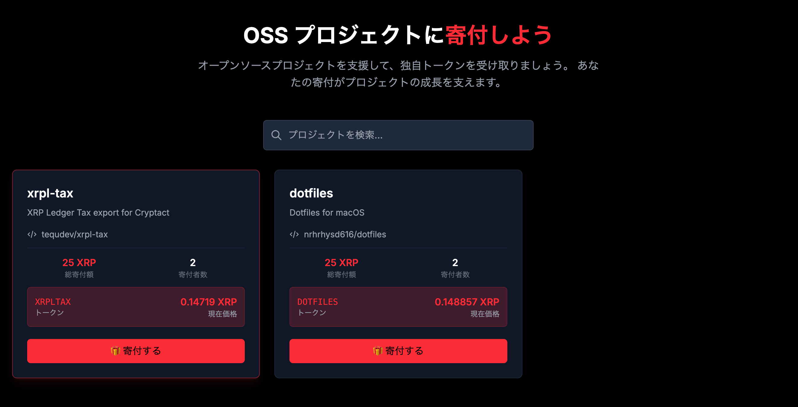
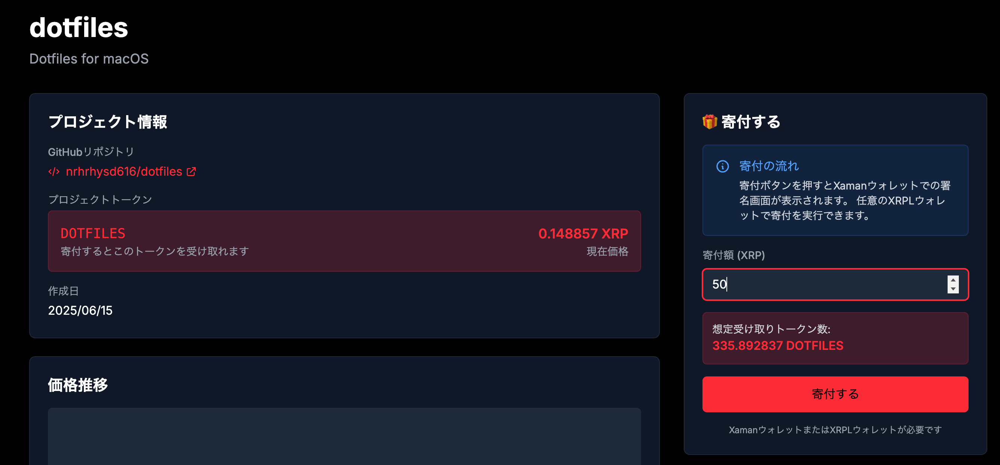
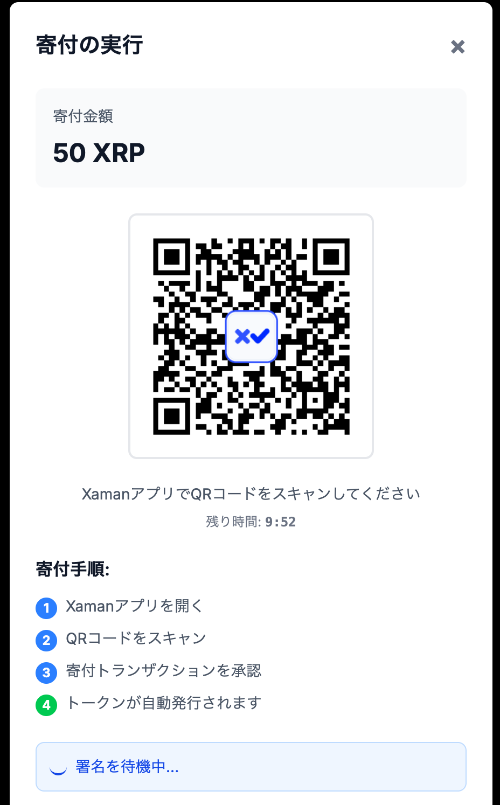
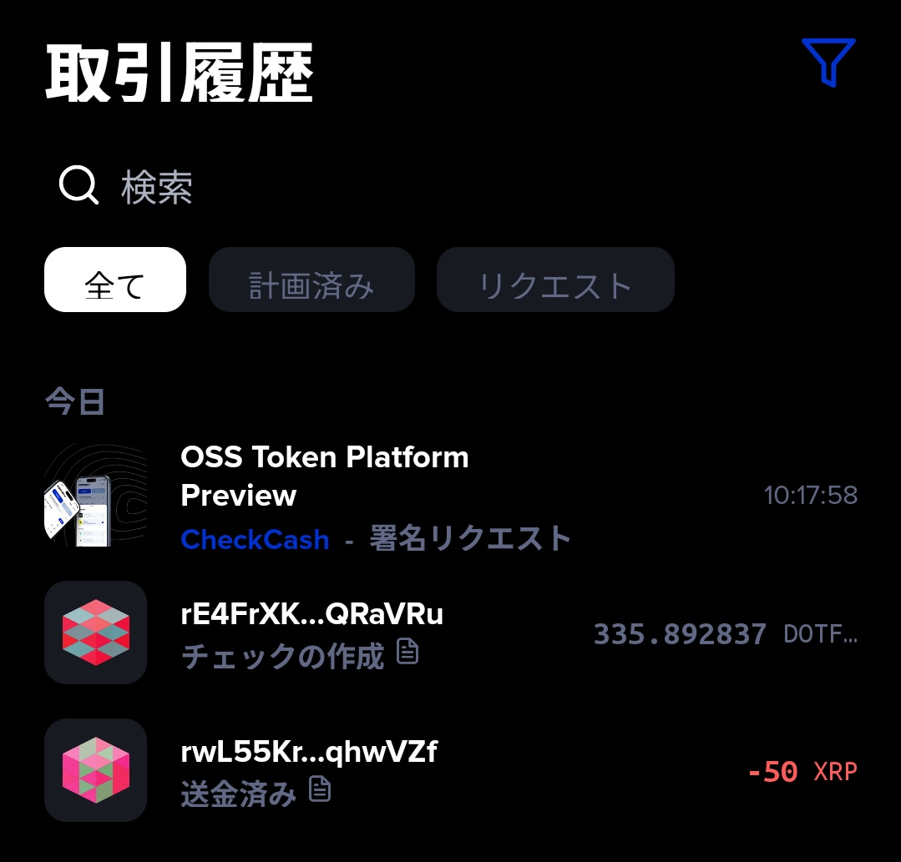
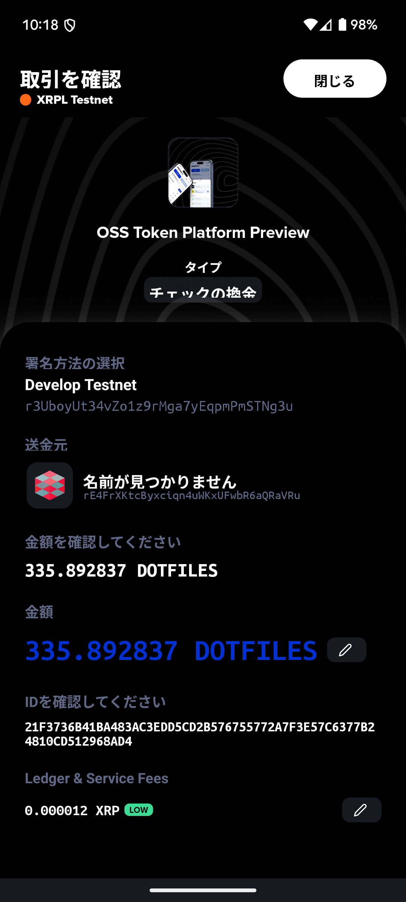

# OSS **Token** Platform

## Web3 × OSS (Open Source Software)

## Building a Sustainable OSS Economy with Support Proof Tokens

### Not an Investment, But Proof of Support

<!--
【原稿】タイトルスライド（15秒）
私の作成したプロダクト「OSS Token Platform」についてご紹介します。

本プロダクトはOSSプロジェクトの資金調達を支援するプラットフォームです。
「投資ではなく、支援の証明」というコンセプトで、支援者にトークンを発行する仕組みです。

【強調ポイント】
- 「投資ではなく、支援の証明」を明確に伝える
- シンプルにプロダクトの概要を説明
-->

---

## Problem: OSS Funding Shortage

### Current Challenges

- **Developer Burnout**: Limits of sustainability due to unpaid work
- **Fundraising Difficulties**: Instability of donations and sponsorships
- **Invisible Support**: Support is not properly recognized

## Result

→ **Excellent OSS projects become difficult to sustain**

<!--
【原稿】問題提起（30秒）
OSSプロジェクトには現状3つの課題があります。

1つ目は開発者の燃え尽きです。無償労働が続くと持続が困難になります。
2つ目は資金調達の不安定さです。寄付やスポンサーシップに依存しているため、収入が予測できません。
3つ目は支援の見えにくさです。
誰がどれだけ支援したかが分からないため、支援者側もモチベーション維持が難しい状況です。

【強調ポイント】
- 3つの課題を整理して分かりやすく説明
- 事実ベースで問題を提示
-->

---

## Solution: What are Support Proof Tokens?

### Conventional Token Thinking

❌ **Consumable Tokens**: Use up and done
❌ **Speculative Value**: Short-term profit seeking

### In This Product

✅ **Holding Tokens**: Value in continued possession
✅ **Support Proof**: "How much you supported" is visible at a glance
✅ **Long-term Relationships**: Sustainable community formation

**"Not an Investment, But Proof of Support"**

<!--
【原稿】解決策の核心（45秒）
これらの問題を解決するため、本プロダクトでは「支援証明トークン」を発行します。

従来のトークンとの違いは主に3点です。
1つ目は保有型であること。使い切るのではなく、持ち続けることに意味があります。
2つ目は支援の可視化。どれだけ支援したかが一目で分かります。
3つ目は長期的な関係構築。一時的な取引ではなく、継続的なコミュニティ参加を促進します。

重要なのは、これは投資商品を想定していないということです。
支援した実績を示すための証明書のような役割を果たします。

次に寄付までのフローを簡単に画像で解説します。

【強調ポイント】
- 3つの特徴を明確に区別して説明
- 「投資ではない」ことを明確に伝える
-->

---

## Flow to Donation

---

### 1. Maintainer Registration via GitHub OAuth and GitHub App

<!--
【原稿】GitHubでのメンテナー登録画面です。OAuth認証でシンプルに登録できます。
-->

---

### 2. Maintainer Registers and Publishes Project

<!--
【原稿】メンテナーがプロジェクト情報を入力し、寄付を受け付ける準備を行います。
-->

---

### 3. Donor Selects Project

<!--
【原稿】寄付者は公開されたプロジェクト一覧から支援したいプロジェクトを選択します。
-->

---

### 4. Donation Amount Input

Donor enters donation amount → Display expected Support Proof Token amount to receive

<!--
【原稿】寄付金額を入力すると、受け取れる支援証明トークンの量がリアルタイムで表示されます。
-->

---

### 5. Donor Scans QR Code to Donate

<!--
【原稿】QRコードが生成され、寄付者はXamanアプリでスキャンして寄付を実行します。
-->

---

### 6. Notification Arrives at Donor's Xaman and Receives Tokens

<!--
【原稿】Xamanに通知が届き、ワンアクションで支援証明トークンを受け取れます。

次に本プロダクトの技術的な特徴を紹介します。
-->

---

## Feature ①: Pre-Money Valuation System

### Dynamic Price Calculation Mechanism

Token Price = Base Price + GitHub Quality Score + Donation Accumulation Effect

#### GitHub Quality Score (Current)

- 📝 Commit Freshness
- ⬇️ Download Count
- ⁉️ Issue Count
- ⭐ Star Count

<!--
【原稿】技術的特徴①（30秒）
1つ目の技術的特徴は、プレマネー評価システムです。

スライドのように、トークンの価格は基準価格に加えて、GitHubの品質スコアと寄付の累積効果によって決まります。
基準価格は最低価格を保証するもので、GitHubの品質スコアはプロジェクトの活動状況を示します。
このようにGitHubのデータを使って、プロジェクトの活動状況を自動で評価します。
現状はコミットの頻度、ダウンロード数、Issue対応、スター数などを総合的に判断して、トークンの価格を算出します。

これにより、プロジェクトが成長すると価格も上昇し、早期に支援した人ほど多くのトークンを取得できる仕組みになっています。

また、基準価格・GitHubの品質スコア算出のためのパラメータ・寄付の累積影響度は、
アプリケーションをリリースすることなく動的に更新可能で、
価格的なハックをされないためにこれらのパラメータは非公開にする予定です。

【強調ポイント】
- 客観的なデータに基づく評価システム
- 早期支援者のメリットを説明
-->

---

## Feature ②: Price Stabilization through RLUSD Conversion

### Solving XRP Volatility Issues

XRP volatility is still significant, causing price fluctuations during donations  
and significant token price changes after donations

To prevent this and stabilize prices during donations, we **utilize the RLUSD order book**

<!--
【原稿】技術的特徴②（30秒）
2つ目は、RLUSD換算による価格安定化です。

XRPに限らず暗号資産は価格変動が大きいため、寄付時等に金額が変わってしまう問題があります。
そこで、RLUSDのオーダーブックを利用して価格を安定化させています。

これにより、寄付者は予想した金額で寄付でき、受け取る側も安定した資金を得ることができます。

【強調ポイント】
- 具体的な問題とその解決策を説明
- ユーザーにとってのメリットを明確に
-->

---

## Feature ③: Check-based Transactions

### Using CreateCheck and CheckCash Transaction Type

#### Conventional Problems

- Trustline setup required in advance
- Risk of user drop-off due to complex procedures

#### Benefits of Check-based TXs

1. **CreateCheck**: Automatically issue and send token checks
2. **CheckCash**: Easy receipt via Xaman app

**Complete token receipt in 2 steps including donation!**

<!--
【原稿】技術的特徴③（30秒）
3つ目は、Check系トランザクションの活用です。

通常、XRPLでトークンを受け取るには事前にトラストラインの設定が必要で、
特に最初にトークンを受け取るための手順が1手多い状態です。
私はXRPLのCheck機能を使って、この問題を解決しました。
Check機能を利用すると、CheckCashという小切手の現金化のためのTXを行うだけで
トラストラインまで自動的に設定されるため、ユーザーは複雑な手順を踏む必要がなくなります。

具体的には寄付をすると、トークンの「小切手」が自動発行されます。
受け取る側はXamanアプリに通知が届き、
ユーザーは通知に従って署名するだけですぐさま現金化できます。

次に、トークンを受け取ったあとのユーティリティとしての機能を次のスライドで紹介します。

【強調ポイント】
- 従来の問題と解決策を分かりやすく説明
- 具体的な時間とステップ数を提示
-->

---

## Future Prospects: Automatic License Key Issuance

### Mechanism

1. Apply for license issuance through a flow similar to donations
2. Automatically issue license keys with periods set according to donation amount and token holdings
3. License keys are viewable on the platform
4. Offline license key verification using addresses within OSS

Token holdings are reflected in discounts and license period extensions  
→ A mechanism where long-term supporters and early supporters hold more and are given preferential treatment

<!--
【原稿】将来展望（20秒）
将来的には、ライセンスキーの自動発行機能を追加予定です。

商用利用時に、トークンの保有量に応じてライセンス料が割引される仕組みです。
トークンを保有している人ほど、より多くの割引や期間の延長を受けられます。

これにより、トークンは単なる記念品ではなく、実用的な価値を持つものになります。

このライセンスキーの機能の他、将来的にはトークン保有者向けの優先サポートや、
OSSプロジェクトへの特別なアクセス権なども検討しています。

また、リップリング等を利用すればOSSから派生する拡張機能などにも応用ができるのではと考えています。

【強調ポイント】
- 将来機能の具体的なメリット
- トークンの実用性を説明
-->

---

## MVP Achievement: **95% Complete**

### ✅ Implementation Complete

- GitHub OAuth, GitHub App
- Project registration and management
- XRPL integration (CreateCheck/CheckCash)
- Donation flow and token issuance
- Pre-Money Valuation System with RLUSD conversion

### 🚧 Short-term Implementation Plans

- License key issuance system
- Private repository support

<!--
【原稿】MVP達成度（15秒）
MVPの達成度です。主要機能は実装完了しています。

GitHub連携、寄付フロー、トークン発行、RLUSD換算機能など、基本的な機能は全て動作します。

【強調ポイント】
- 実装状況を簡潔に報告
- 動作するプロダクトであることを伝える
-->

---

## Demo Introduction

### See the Actual Operation

#### Demo Content

1. ~~**Maintainer Registration Flow**: From GitHub integration to project registration~~ (Omitted)
2. **Donation Flow**: From QR code scanning to donation completion
3. **Token Receipt**: Check cashing in Xaman

**Seamless experience completing donation and token receipt in 2 steps**

<!--
【原稿】デモ紹介（45秒）
最後に実際の動作をご覧ください。

寄付フローをデモします。QRコードをスキャンして寄付し、Xamanアプリでトークンを受け取るまでの流れです。

注目していただきたいのは、操作の簡単さです。複雑な設定は不要で、
トータル約30秒で寄付からトークン受け取りまで完了します。

技術的な複雑さをユーザーから隠蔽し、簡単に支援できる仕組みを目指しています。

【強調ポイント】
- デモの内容を事前に説明
- 操作の簡単さを強調
- ユーザビリティの重要性を伝える
-->

---

## Summary

### 🎯 **Vision**

A sustainable OSS economy through "Support Proof Tokens"

### 🚀 **Innovative Features**

Pre-Money Valuation × RLUSD Stabilization × Check-based Transactions

### 💡 **Practicality**

Future automatic license key issuance and OSS priority support through token holdings

<!--
【原稿】まとめ（15秒）
最後にまとめです。

「支援証明トークン」により、持続可能なOSS支援の仕組みを提供します。
プレマネー評価、RLUSD安定化、Check系トランザクションの3つの技術で、実用的なソリューションを実現します。
将来的な機能の追加により、トークンは単なる支援の証明ではなく、
実用的な価値を持つものとして複数の機能を提供したいと考えています。

ご清聴ありがとうございました。

【強調ポイント】
- 3つの技術要素を再確認
- 実用性を最後に強調
- 簡潔に締めくくる
-->
